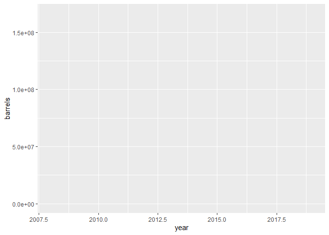
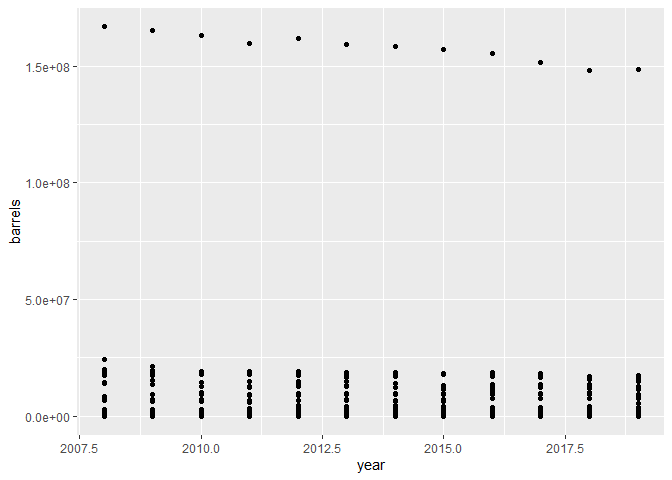
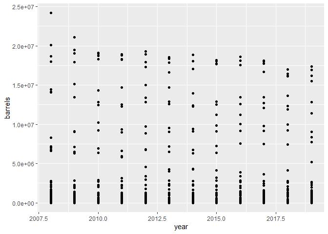
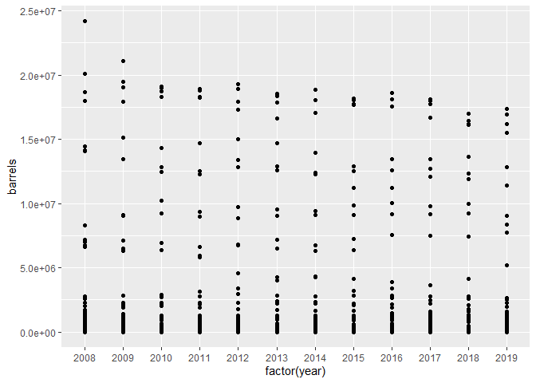
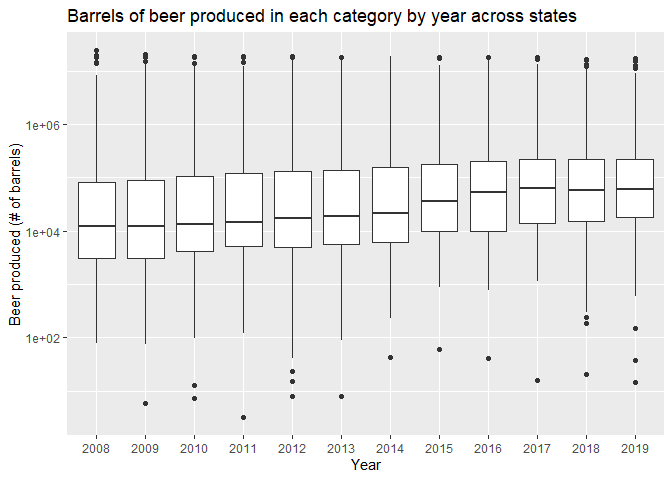
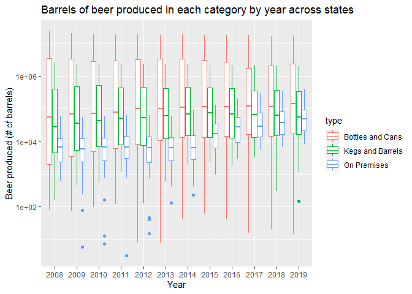
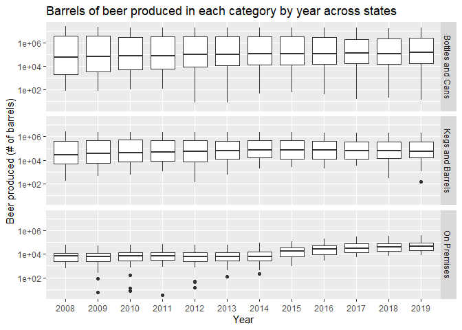
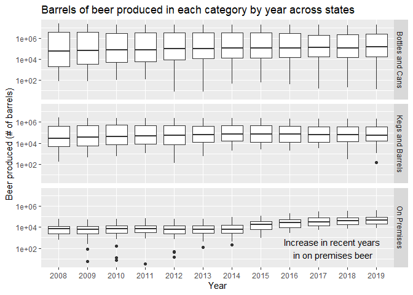
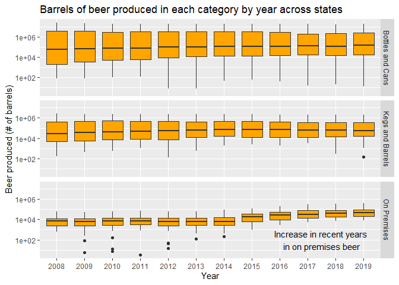
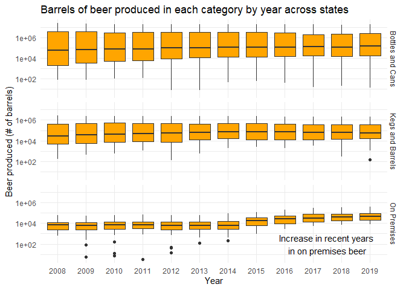

We're going to use data from #TidyTuesday, for anyone not aware check out it's [github page](https://github.com/rfordatascience/tidytuesday) for more information. Essentially a weekly dataset is released, and anyone can create a visualization however they want, and show it to the world using the #TidyTuesday on twitter (a really good way to get your data visualizations out there!).

We're going to look at the data on beer from week 14!

Start by pulling the data using the `{tidytuesdayR}` package then assigning each individual data frame to its own object.


```r
# install.packages("tidytuesdayR")
library(tidytuesdayR)
beer <- tt_load(2020, week = 14)
```

```
## 
## 	Downloading file 1 of 4: `beer_states.csv`
## 	Downloading file 2 of 4: `beer_taxed.csv`
## 	Downloading file 3 of 4: `brewer_size.csv`
## 	Downloading file 4 of 4: `brewing_materials.csv`
```

```r
beer_states <- beer$beer_states
beer_taxed <- beer$beer_taxed
brewer_size <- beer$brewer_size
brewing_materials <- beer$brewing_materials
```

I've only got half an hour so just going to look at improving a simple visualization that doesn't require much pre-processing of the data.
The figures come from the `beer_states` dataset:


```r
head(beer_states)
```

```
## # A tibble: 6 x 4
##   state  year barrels type       
##   <chr> <dbl>   <dbl> <chr>      
## 1 AK     2008   2068. On Premises
## 2 AK     2009   2264. On Premises
## 3 AK     2010   1929. On Premises
## 4 AK     2011   2251. On Premises
## 5 AK     2012   2312. On Premises
## 6 AK     2013   2156. On Premises
```

```r
# remove all rows with an NA or 0 in barrels column, 
# I'm sure these have an interesting story but I've not got time to 
# explore it here!
library(dplyr)
beer_states <- beer_states %>%
  filter(!is.na(barrels),
         barrels != 0)
```

Starting with a simple plot of the number of barrels produced by year. This is where we finally get to use `{ggplot2}` - there's some steps that will be necessary throughout all of your ggplot's so I'll introduce those first.


```r
# first load (and maybe install if you need to) the ggplot2 package
#install.packages("ggplot2")
library(ggplot2)

# All plots begin with a call to ggplot, inside we specify the data we're going
# to create our visualization from
ggplot(data = beer_states)
```

<!-- -->

This returns a blank plot, and it's from here that we start to build our plot.

We decided to plot number of barrels produced by year, to specify this we can add to our `ggplot` call by passing information through to the `mappings` argument via the `aes` function as follows:


```r
ggplot(data = beer_states,
       mapping = aes(x = year,
                     y = barrels))
```

<!-- -->

So this time we get a blank plot, but our axis are in place with the correct range of values and labels taken straight from the column names.

No data has been plotted yet because we've not told `{ggplot2}` how we'd like our data to appear. This is where we get to start making choices beyond just our data. I'd highly recommend starting with the [`{ggplot2}` cheatsheet](https://rstudio.com/wp-content/uploads/2015/05/ggplot2-cheatsheet.pdf). 

In our case we've got two variables (R thinks they're both continuous but we know that really `year` is categorical) so we can see from the cheatsheet there's plenty of options. We'll start with a simple scatter plot using `geom_point`


```r
ggplot(data = beer_states,
       mapping = aes(x = year,
                     y = barrels)) + # we chain functions together using `+` 
                                     # think of it as the %>% for ggplots
  geom_point()
```

<!-- -->

Not the best plot - we see a massive outlier for each along the top of the plot, a bit of investigation and we realise this is actually the total row for each year which combines the barrels produced from each state for every year. Let's remove these rows using `filter` from `{dplyr}`


```r
library(dplyr)

beer_states %>%
  arrange(-barrels) %>% 
  head()
```

```
## # A tibble: 6 x 4
##   state  year    barrels type            
##   <chr> <dbl>      <dbl> <chr>           
## 1 total  2008 166930012. Bottles and Cans
## 2 total  2009 165432247. Bottles and Cans
## 3 total  2010 162972113. Bottles and Cans
## 4 total  2012 161692656. Bottles and Cans
## 5 total  2011 159708194. Bottles and Cans
## 6 total  2013 159413579. Bottles and Cans
```

```r
# remove all rows where state = total
beer_states <- beer_states %>%
  filter(state != "total") # read this as "take all rows where state is not equal to total"
```

Now let's have a look at the plot from before


```r
ggplot(data = beer_states,
       mapping = aes(x = year,
                     y = barrels)) + 
  geom_point()
```

<!-- -->

So our data is a bit clearer to see now. Next we want to convert our `year` variable so that it's a factor rather than it's current numerical state. This is as simple as wrapping our call to `year` in the `aes` function with the `factor` function like so:


```r
ggplot(data = beer_states,
       mapping = aes(x = factor(year),
                     y = barrels)) + 
  geom_point()
```

<!-- -->

Great - this has also sorted out the axis ticks! One thing I'm not so keen on is the high density of points at the bottom of the plot for all years, as the values are close together the points overlap so it's hard to tell how many are _really_ down there.

One solution is to change our geom, `geom_jitter` will add some random noise to each observation to spread them out. Here we only want some horizontal jitter, any vertical jitter would change the value of `barrels` that we perceive for that point. We can control the amount of horizontal and vertical jitter using `height` and `width` respectively (I had to check the help file for that dw)


```r
ggplot(data = beer_states,
       mapping = aes(x = factor(year),
                     y = barrels)) + 
  geom_jitter(height = 0,
              width = 0.2)
```

<!-- -->

It takes a bit of experimenting with the value of `width` to get the right amount of _jitter_, but `0.2` seems to work well. We want to be able to see most of the points (or at least appreciate the density of points everywhere) but still have clearly defined categories (in this case the years).

Editing the labels on a ggplot can be done in two different ways, either specifying all labels in the `labs` function, or for significant labels like the title and the axis there are specific functions: `xlab`, `ylab` and `ggtitle`. For now I'm going to use `labs` but it really doesn't matter


```r
ggplot(data = beer_states,
       mapping = aes(x = factor(year),
                     y = barrels)) + 
  geom_jitter(height = 0,
              width = 0.2) +
  labs(x = "Year",
       y = "Beer produced (# of barrels)",
       title = "Barrels of beer produced in each category by year across states")
```

<!-- -->

Looking at the long tail for each year, it might be worth looking at this plot with a logarithmic scale on the y axis, we can implement this using one of the `scale_*` functions from `{ggplot2}`, there's a wide range of them but here we'll need to find the one which implements logarithms base 10.


```r
ggplot(data = beer_states,
       mapping = aes(x = factor(year),
                     y = barrels)) + 
  geom_jitter(height = 0,
              width = 0.2) +
  labs(x = "Year",
       y = "Beer produced (# of barrels)",
       title = "Barrels of beer produced in each category by year across states") +
  scale_y_log10()
```

<!-- -->

I don't know if the points are working for me, luckily all we need to do to change the geom is change the call from `geom_jitter` to `geom_boxplot` (for example)


```r
ggplot(data = beer_states,
       mapping = aes(x = factor(year),
                     y = barrels)) + 
  geom_boxplot() +
  labs(x = "Year",
       y = "Beer produced (# of barrels)",
       title = "Barrels of beer produced in each category by year across states") +
  scale_y_log10()
```

<!-- -->

We actually have 3 different types of beer output in this dataset


```r
unique(beer_states$type)
```

```
## [1] "On Premises"      "Bottles and Cans" "Kegs and Barrels"
```

Splitting our plot so that there's a separate box plot for each type of beer is as easy as adding to the `aes` call in our initial call to `ggplot`.


```r
ggplot(data = beer_states,
       mapping = aes(x = factor(year),
                     y = barrels,
                     colour = type)) + 
  geom_boxplot() +
  labs(x = "Year",
       y = "Beer produced (# of barrels)",
       title = "Barrels of beer produced in each category by year across states") +
  scale_y_log10()
```

<!-- -->

This plot isn't ideal - everything's a bit squished. Something we could try instead is 'faceting', in this case that's where each type of beer will get it's own plot:


```r
ggplot(data = beer_states,
       mapping = aes(x = factor(year),
                     y = barrels)) +  # remove colour = type 
  geom_boxplot() +
  labs(x = "Year",
       y = "Beer produced (# of barrels)",
       title = "Barrels of beer produced in each category by year across states") +
  scale_y_log10() +
  facet_grid(rows = vars(type)) # have to wrap the variable with `vars()`
```

<!-- -->

Adding an annotation on to just the "On Premises" plot is the trickiest thing we'll do in this example (and took the most googling during my prep). It requires defining a new data frame which we pass through to `geom_text`.


```r
# To add annotations to a facetted plot we need a separate data frame
# (I'll be honest this bit took some googling)
df <- data.frame(x = 10.5, 
                 y = 100,
                 label = "Increase in recent years \nin on premises beer",
                 type = "On Premises")

ggplot(data = beer_states,
       mapping = aes(x = factor(year),
                     y = barrels)) + 
  geom_boxplot() +
  labs(x = "Year",
       y = "Beer produced (# of barrels)",
       title = "Barrels of beer produced in each category by year across states") +
  scale_y_log10() +
  facet_grid(rows = vars(type)) +
  geom_text(mapping = aes(x = x, y = y, label = label),
             data = df,
             size = 4) # The size argument does what it says on the tin
```

<!-- -->

Now we can focus on colouring and making cosmestic changes to our plot, we can make our boxplots look (kind of) like beer by giving them a lovely orange colour. Pass `'orange'` through to the fill argument of `geom_boxplot`.


```r
df <- data.frame(x = 10.5, 
                 y = 100,
                 label = "Increase in recent years \nin on premises beer",
                 type = "On Premises")

ggplot(data = beer_states,
       mapping = aes(x = factor(year),
                     y = barrels)) + 
  geom_boxplot(fill = 'orange') +
  labs(x = "Year",
       y = "Beer produced (# of barrels)",
       title = "Barrels of beer produced in each category by year across states") +
  scale_y_log10() +
  facet_grid(rows = vars(type)) +
  geom_text(mapping = aes(x = x, y = y, label = label),
             data = df,
             size = 4)
```

<!-- -->

There's loads of little changes we can make to the look of our plot (just check out all the arguments to the `theme` function). So you've got a massive amount of control over your plot. But, if you're lazy like me, there's so pre-made themes you can use... just tag the theme function you want on to the end of our stack of functions


```r
df <- data.frame(x = 10.5, 
                 y = 100,
                 label = "Increase in recent years \nin on premises beer",
                 type = "On Premises")

ggplot(data = beer_states,
       mapping = aes(x = factor(year),
                     y = barrels)) + 
  geom_boxplot(fill = 'orange') +
  labs(x = "Year",
       y = "Beer produced (# of barrels)",
       title = "Barrels of beer produced in each category by year across states") +
  scale_y_log10() +
  facet_grid(rows = vars(type)) +
  geom_text(mapping = aes(x = x, y = y, label = label),
             data = df,
             size = 4) +
  theme_minimal()
```

<!-- -->

As you can see the theme makes a big difference here!

Well that's it for building up this ggplot, thanks for listening/reading/watching and any questions feel free to get in touch: jtalboys@mango-solutions.com
